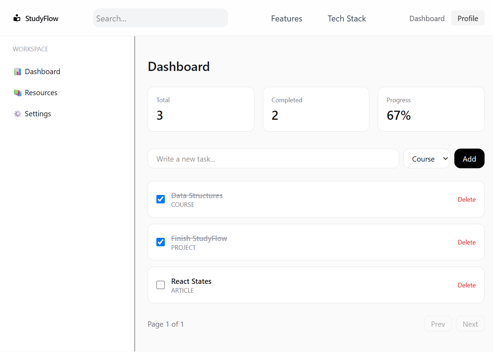

# StudyFlow
StudyFlow is a full-stack web app I built to organize courses, articles, and projects in one dashboard. Users can create an account, track learning resources, mark items complete, edit them, and view overall progress.

## Live Demo

**Frontend:** https://study-flow-edu-track.vercel.app

**Backend API:** https://studyflow-api-y3d0.onrender.com

> The backend is hosted on Render and may take a few seconds to respond after a period of inactivity.

## Features

- Modern public landing page with dashboard preview
- User registration and login
- JWT-based authentication
- Protected dashboard route
- User-scoped resource management
- Create courses, articles, and projects
- Edit resource titles inline
- Mark resources as completed or active
- Delete resources
- Completion and progress statistics
- Client-side pagination
- Loading and error states
- Responsive user interface
- Dedicated Features and Tech Stack pages

## Tech Stack

### Frontend

- React
- TypeScript
- React Router
- Tailwind CSS
- Axios
- Vite
- Lucide React

### Backend

- Node.js
- Express
- TypeScript
- Prisma ORM
- PostgreSQL
- JSON Web Tokens
- bcrypt

### Testing and Code Quality

- Vitest
- React Testing Library
- ESLint

### Deployment

- Vercel — frontend
- Render — backend API
- PostgreSQL — persistent application data

## Screenshot



## Project Structure

```text
StudyFlow/
├── client/
│   ├── public/
│   └── src/
│       ├── assets/
│       ├── components/
│       ├── pages/
│       ├── services/
│       └── test/
│
├── server/
│   ├── prisma/
│   │   └── schema.prisma
│   └── src/
│       ├── controllers/
│       ├── middleware/
│       ├── routes/
│       ├── services/
│       ├── utils/
│       └── index.ts
│
├── docs/
│   └── API.md
│
├── README.md
└── vercel.json
```

## Local Setup

### 1. Clone the repository

```bash
git clone https://github.com/tyang019/StudyFlow.git
cd StudyFlow
```

### 2. Install frontend dependencies

```bash
cd client
npm install
```

### 3. Install backend dependencies

```bash
cd ../server
npm install
```

### 4. Configure environment variables

Create a `client/.env` file:

```env
VITE_API_URL=http://localhost:5000/api
```

Create a `server/.env` file:

```env
DATABASE_URL=your_postgresql_connection_string
JWT_SECRET=your_jwt_secret
```

### 5. Run the backend

From the `server` directory:

```bash
npm run dev
```

The backend runs locally at:

```text
http://localhost:5000
```

### 6. Run the frontend

From the `client` directory:

```bash
npm run dev
```

Vite will display the local frontend URL, typically:

```text
http://localhost:5173
```

## Testing

Run frontend tests:

```bash
cd client
npm run test:run
```

Run ESLint:

```bash
npm run lint
```

Create a production build:

```bash
npm run build
```

## API Documentation

See [`docs/API.md`](docs/API.md) for authentication and resource endpoint documentation.

Production API base URL:

```text
https://studyflow-api-y3d0.onrender.com/api
```

## Future Improvements

- Add more frontend tests
- Add backend tests
- Add GitHub Actions
- Improve API validation and error handling
- Add a demo account